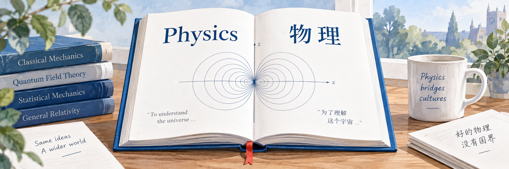

<a href="README.md">🇺🇸 English</a> | <a href="README.zh.md">🇨🇳 中文</a>

<h1 align="center">David Tong 讲义中文翻译</h1>

 

## 引言

本项目计划将 David Tong 公开讲义翻译为中文，保留其物理含义、公式、符号约定和解释风格。这是独立的社区项目。

原始来源：[官方教学目录](https://www.damtp.cam.ac.uk/user/tong/teaching.htm)。

## 工作流程

每章依次完成来源核验、初译、物理校对、中文校对、编译检查和发布。详见[翻译规则](docs/translation-rules.md)。

[arXiv 来源目录](catalog/arxiv-sources.json)记录讲义版本。运行 `python3 tools/download_arxiv_sources.py`，即可将 PDF、原始源码包和解压后的 TeX 保存至 `downloads/arxiv/`，本地下载报告记录校验值与文件数量。

## 目录

- `catalog/`：来源清单与版本
- `glossary/`：全局与各课程术语
- `lectures/`：每门课程独立目录，保存章节源文件与校对记录
- `tools/`：构建与一致性工具
- `docs/`：工作流程与许可记录

## 许可证

Apache-2.0 用于项目原创工具与配置，不授予 David Tong 原讲义、衍生译文或第三方插图的使用权。详见[许可范围](docs/licensing.md)与 [LICENSE](LICENSE)。
